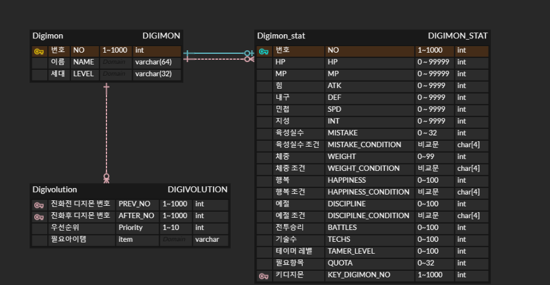

# Digimon Decode DB ERD

* 위의 이미지는 디지몬 진화표를 구성하기 위한 테이블들의 모습입니다.

## 1. Digimon 테이블
* 디지몬의 기본정보를 표시합니다.
* No는 게임내 도감상의 번호로 이를 기본키로 가집니다. 
* Level은 디지몬의 성장기, 성숙기, 완전체등을 표시하기 위한 것입니다.

## 2. Digivolution
* 디지몬의 진화 관계를 표시하기 위한 테이블입니다.
* 진화전 디지몬 번호와 진화 후 디지몬 번호 두개로 기본키를 구성합니다.
* 각각의 디지몬 번호는 Digimon 테이블의 외래키입니다.

## 3. Digimon_stat
* 진화 조건용 테이블입니다.
* 해당 디지몬으로 진화하기 위한 조건이있는 테이블입니다.
* Digimon 테이블을 부모 테이블로 가지며 식별관계에 속합니다.
* 필드 중 _CONDITON 이 붙은 것들은 >= , ==, < 등 부등호를 나타내기 위해서 넣었습니다.
* 예로 MISTAKE 가 6 이고 MISTAKE_CONDITON 이 <= 인 경우 육성실수 6회 이하를 뜻합니다.